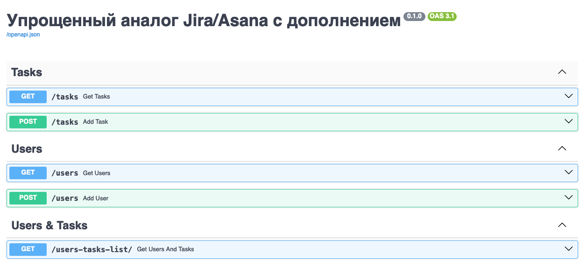

## О проекте
Это дополнение к проекту Артёма Шумейко

[Видео о луковой архитектуре](https://www.youtube.com/watch?v=8Im74b55vFc)  
[Видео о паттерне Unit of work](https://www.youtube.com/watch?v=TaYg23VkCRI)

У Артёма представлены четыре варианта ответа сервера: 
- конкретный пользователь по его ***id***, либо все пользователи сразу
- конкретное задание по его ***id***, либо все задания сразу

я сделал дополнение -  возможность получить от сервера список следующего вида:

| название        | автор      | ответственный  |
| -----------     | ---------- | ----------     |
| купить овощи    | Роман      |  Иван          |
| помыть овощи    | Роман      |  Антон         |
| нарезать овощи  | Екатерина  |  Дмитрий       |
| достать кастрюлю| Фома       |  Антон         |
| вскипятить воду | Альберт    |  Феликс        |
| положить овощи  | Роман      |  Клава         |


### Запуск приложения
1. Создать виртуальное окружение и установить зависимости
2. Вызвать в терминале `python3 src/main.py`

~~### Настройка Alembic для асинхронного драйвера~~
~~1. Находясь в корневой директории, запустить  ~~
~~`alembic init -t async migrations` ~~
~~2. Перенести папку `migrations` внутрь папки `src`. ~~
~~3. Заменить `prepend_sys_path` на `. src` и `script_location` на `src/migrations` внутри `alembic.ini` ~~

по данной инструкции создать БД у меня не получилось, поэтому я в коде сделал,
что при запуске выполняется команда:

\```python
Base.metadata.create_all
\```


### Документация к API

